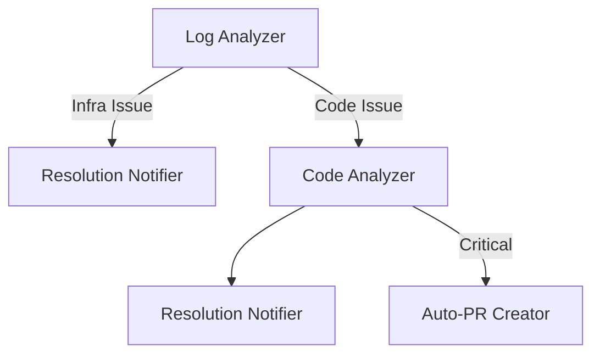

AI Agents to automate Lambda failure analysis using CloudWatch logs and Microsoft Teams alerts

1. Trigger & Alert Parser
Microsoft Teams alert → Alert Parser extracts

2. CloudWatch Logs Fetcher 
Retrieves error logs using LambdaFunctionName and ErrorTime.

3. Log Analyzer (LLM-Based)
Classify the error type from logs:
Infrastructure Issue (e.g., timeout, permissions) → Proceed to Resolution Notifier.
Code-Related Issue (e.g., NullPointerException, SyntaxError) → Trigger Code Analyzer Agent.

4: Code Analyzer
Fetch relevant code from CodeCommit and diagnose bugs.

5. Resolution Notifier

6.(Optional) Auto-Pull Request

Key Architecture:

Implementation Notes
AWS Permissions:
Grant the agent permissions for:
codecommit:GetFile (read code).
codecommit:CreatePullRequest (if auto-PR is enabled).

LLM Context Handling:
Use small, relevant code snippets (avoid sending entire files).
Focus on error lines + surrounding 10-20 lines.

Error Classification Rules:
Heuristics to decide "code vs. infra":
Code: Stack traces, NameError, TypeError.
Infra: Timeout, PermissionDenied.

